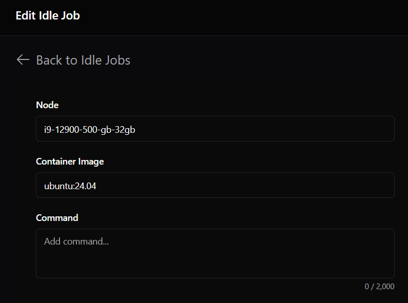
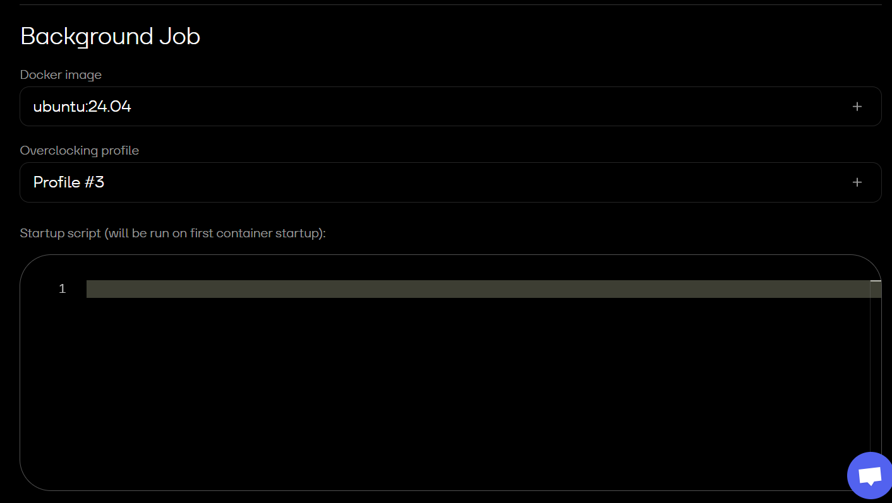

-- Docker Events watcher -- 
- ... start/stop mining with active idle job Clore / Octaspace / Nosana
- testing new Nosana podman ... 'source/docker_events_universal-docker-podman.sh'
- ... 15 second some type of server test happens between benchmarks, maybe is confirming server specs
- ... PODMAN_IDLE_CONFIRM_LOOPS, IDLE_CONFIRMATION_THRESHOLD should be at least 4 to safely cover time between container load/unload etc
- ** use extreme caution when using any type of custom scripts **
- ** your risking host/account being banned **
- added -retry-on-failure versions, docker events in a loop in case fails/disconnects
- 'sudo docker ps' shows current running images/containers
- start/stop/pause idle job and watch logs to test, confirm all working as expected
- follow logs: sudo journalctl -u docker_events_gpu.service -f
- show more history: sudo journalctl -u docker_events_gpu.service -e
- ctrl+c to leave logs
- nvidia gpus nvtop : sudo apt install -y nvtop
- amd gpus rocm-smi
- ubuntu server 24.04 rigs I use idle job image "ubuntu:24.04" as placeholder idle job on Clore / Octaspace
- ubuntu server 22.04 for AMD gpu rig, better driver/overclock compatible
- copy/paste press enter contents of docker_events_gpu.sh, docker_events_cpu.sh to write script files with your mining settings into ubuntu server console
- copy/paste press enter contents of docker_events-services.sh to create services, enable, start service's etc
- 'gpu_reset - Nvidia.sh' if needed
- if miner isnt starting test the actual command being run from the logs ... command:
- some miners need libpocl2 for cpu: sudo apt install -y libpocl2
- miners load in a screen session by name of SCREEN_NAME
- sudo screen -ls to list active sessions
- sudo screen -r name to re-open/join session
- ctrl a+d to leave session with miner runnning
- ctrl c to stop miner
- exit to close screen session
- == main complete package in source folder ==
- tested with 1 gpu rigs only
- for easiest setup install ubuntu server with username user
- services assume .conf files are in /home/user/ and named rig-cpu.conf or rig-gpu.conf etc
- scripts need absolute path '/home/user/' current user reference doesnt work
- TARGET_IMAGE in cpu/gpu .conf files needs to match chosen idle job image name
- using putty ssh or similar copy/paste contents of 'install - script files.sh' into rig console and
- press enter to write all the script files, lists files at the end to see files were created
- copy/paste press enter contents of other install-*** conf etc files
- include api.conf if using miner api and one of the gpu-reset scripts if needed, Nvidia, AMD
- seperate script files in source/lib folder just to make easier to read
- batch files can be used to send new .conf files to a list of rigs from windows pc
- %CPU_THREADS% in args will add number of threads minus one (total -1),
- affinity will be added with threads for xmrig miner see 03-cpu_threads.sh in 'install - script files.sh' to customise
- see rig conf examples...

Octa Idle job:

Clore Idle job:

Some portions of this project were developed with assistance from ChatGPT.
